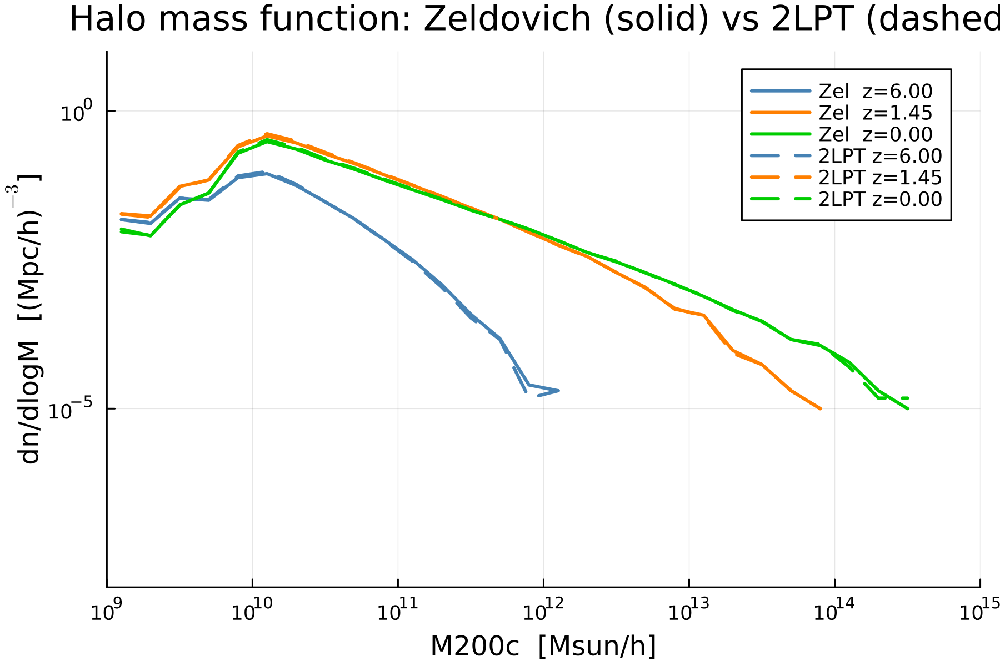

# Table of contents

1. [Introduction](#introduction)
1. [Installing Ginnungagap](#installing-ginnungagap)
1. [Basic usage](#basic-usage)
1. [Advanced usage](#advanced-usage)
   1. [Grids, tools and files](#grids-tools-and-files)
   1. [Hierarchy and tiles](#hierarchy-and-tiles)
   1. [ini file options](#ini-file-options)
      1. [Common building blocks](#common-building-blocks)
      1. [ginnungagap](#ginnungagap)
      1. [generateICs](#generateics)
      1. [realSpaceConstraints](#realspaceconstraints)
      1. [refineGrid](#refinegrid)
1. [Tests](#tests)
1. [End note](#end-note)

# Introduction

Ginnungagap is a code to prepare cosmological initial conditions (ICs). Its main features are the following:

* MPI+OpenMP efficient parallelization.
* Homogeneous resolution and variable resolution (zoom-in) ICs.
* Resolution extension: increasing/reducing the resolution of existing simulations.
* Reuse of previous computations: all intermediate results are saved as files and can be used multiple times.
* Output in GADGET-2 and GRAFIC formats (currently zoom-in ICs are only in GADGET-2 format).
* Modular structure: code is a collection of separate tools.

The more detailed explanation of concepts behind Ginnungagap and some test results can be found in the paper [g9p paper](http://arxiv.org/abs/2511.10353).

# Installing Ginnungagap

The main requirements of Ginnungagap are:

* FFTW-3
* Gnu Scientific Library
* SPRNG-2
* MPI and HDF5 are highly recommended.
* Fortran is currently required, but will be removed in future.

The simplest way to download and build them is to use the following installer script:

[scripts/g9p_installer.sh](https://github.com/ginnungagapgroup/ginnungagap/blob/master/scripts/g9p_installer.sh)

Use the options at the beginning of the script to turn off compilation of some of the libraries:
```
gsl=true
fftw=true
hdf5=true
sprng=true
g9p=true
```

Also one can use it as an example of what build flags are required. The recommended versions of the required libraries are: FFTW 3.3.4, GSL 1.16, SPRNG 2.0b, HFD5 1.14.0. Other versions of these libraries have not been tested, besides HDF5 1.8.20 which also works.

It is usually *NOT* recommended to use a version of HDF5 provided by your system, since Ginnungagap uses a custom set of compile flags. 

After installation, all the Ginnungagap binaries can be found in `ginnungagap/bin/`. All the other libraries compiled by the installer script are at `libs/`. You need to update your LD_LIBRARY_PATH with the path to the newely installed libraries, e.g., in bash shell:
```
export LD_LIBRARY_PATH=/full/path/to/installation/libs
```

# Basic usage

A collection of basic examples can be found in `ginnungagap/doc/examples/`. In order to prepare a simple homogeneous ICs, please, create a working directory, and copy to it `example_64.ini`, `prepare_ini.sh` and `batTemplate_local.sh`. Also copy all the contents of `ginnungagap/bin`.

Ginnungagap consists of several tools, and running the code can be done with the following commands (assuming you are in the working directory):
```
./prepare_ini.sh example_64.ini
make gadget
```
After that you will find the file called `GADGET` which contains the ICs ready to use. Also many other files are created.

The first line invokes the helper script which creates a Makefile containing actual commands. In the case of a non-zoomed ICs, there are two commands: a call to `ginnungagap` and a call to `generateICs`.

`ginnungagap` tool first creates a White Noise (WN), which is a 3D grid of random numbers with Gaussian distirbution. This grid is saved to a file `wn_64.h5` and can be used for e.g. making a higher resolution simulation with the same large scale structure. Then, the WN is convolved with the transfer function (which depends on the cosmological power spectrum) to compute the velocity field (VF): three grids, one for each velocity component. These grids are also saved as `g9p_vel*.h5`. Details on their computation can be found in the code paper.

`generateICs` converts the VFs into a particle representation in GADGET-2 format (actually, `SnapFormat 1` in GADGET's terminology).

This example file, `example_64.ini` can be easily modified for the user's needs, all its options are either self-documenting, or have comments.

In order to make a simple resimulation with higher resolution, 128^3 particles, see the `example_upgrade.ini`. This example assumes you have already run the previous example, `example_64.ini` and have not deleted the `wn_64.h5` file. The Makefile now contains the following commands:

1. `ginnungagap ggp_64.ini` to make 64^3 VFs from the existing WN.
1. `realSpaceConstraints scale_wn128.ini` to scale up the WN to a 128^3 grid.
1. `ginnungagap ggp_128.ini` to make small scale VFs from the WN on 128^3 grid.
1. `refineGrid ref_{x,y,z}_128.ini` to take the large scale Fourier modes from 64^3 VFs, small scale Fourier modes from the previous step, and make the final 128^3 VFs.
1. `generateICs genics_128.ini` to save the particle data in GADGET_UP file in GADGET format.

The third example, `example_zoom.ini` is aimed at making the zoom-in ICs with the resolutions 32^3, 64^3, 128^3 and 256^3. Also the file with the mask, defining the zoom region, `lare.dat`, is needed. The ini file, besides quite obvious list of zoom resolutions and random seeds for them also contains the information on how to distribute zoom levels across GADGET particle types and how many files per level is to be made.

GADGET-2 files contain 6 particle types, type 0 is gas, type 1 is DM. Other types also behave as DM in non-hydro simulations. In zoom simulations particles of different zoom levels have different masses, and there are several options how they can be represented in the ICs: 

* A mass block can be provided in the ICs with individual particle masses using `doMassBlock = true` in the ini file. In that case all the particles can be set to type 1.
* Assign different types to different levels for DM only runs. Highest resolution is usually type 1. No individual masses are needed, as masses for each type can be given in the ICs file header. This option is limited by the number of available types.
* A combined method: assign the highest resolution particles to type 1 and assign all or some of the other levels to a single another type (e.g., type 2). Only when there are several levels per type the mass block will be automatically created for this particular type.

In the example, find the line
```
gadgetTypes = 4 2 2 1
```
The types are given in the same order as meshes in the beginning of the ini file. This means that lowest resolution level (32^3) will have type 4, and particle mass for this level will be given in the header (no mass block). Levels 64^3 and 128^3 will share type 2, so for them there will be a mass block created. Higest resolution particles (256^3) will go to type 1, as usual (and with no mass block).

GADGET-2 supports multiple file ICs and in Ginningagap every level is written to a separate file (even if several levels share the same particle type). A single GADGET-2 file is limited by approximately 300*10^6 particles (if single precision is used), since data blocks must be compatible with Fortran records. Thus, user can divide each level into many files by providing corresponding numbers in the `gadgetNFiles` parameter in the ini file.

The zoomed ICs also require a mask which defines which parts of the simulation volume are filled with highest resolution level particles. This mask is obtained by running a low resolution simulation e.g. 64^3 in this example, and marking all cells at the 64^3 grid which belong to the zoom region, but in Lagrangian coordinates, i.e. in the initial conditions. The Lagrangian region covering the high resolution region is provided in the file `ginnungagap/doc/examples/lare.dat`. This file contains 10 columns: particle IDs, 3 columns of coordinates, 3 columns of velocities and 3 columns of 1D cell indices, in which these particles reside. Only the last three columns are used by Ginnungagap. Other columns are needed for compatibility with some other tools. Every row of `lare.dat` contains coordinates of a single cell in the base level resolution, which is provided by the `maskMesh` parameter.

You also may notice that all the commands are placed not directly in the Makefile, but in a bunch of `bat_*` files. This is not needed for the code execution on the local machine, but allows to prepare submit scripts for supercomputers using some workload managers like Slurm.

# Advanced usage

## Grids, tools and files

Let's start again by considering the single resolution ICs. The way in which Ginnungagap creates ICs can be represented by the following diagram:
```
WN -----------> VFs -------------> GADGET/GRAFIC files
   convolution      Zel'dovich
   with             approximation
   P(k)
```
where WN stands for the White Noise -- a grid of Gaussian random numbers with zero mean and unit variance. VFs are velocity fields -- the same grid filled with three velocity components. The creation of new random WN and conversion of WN into VFs is done with the help of `ginnungagap` tool. Both WN and VFs are stored in files, by default, in HDF5 format (otherwise can be stored in GRAFIC format). ICs files in GADGET-2 format (format type 1, without block names) can be created with the `generateICs`, and ICs in GRAFIC format are made by `graficCoord`. In both cases, the Zel'dovich approximation (ZA) is applied to produce particle coordinates from velocity fields.

Optionally, second-order Lagrangian perturbation theory (2LPT) corrections can be applied instead of the plain ZA. When `do2LPTCorrections = true` is set in the `ginnungagap` ini file, the tool additionally computes the second-order source term S^(2)(k) from the density field and writes a second set of velocity fields, `*_velx_2lpt.h5`, `*_vely_2lpt.h5` and `*_velz_2lpt.h5`, alongside the usual first-order VFs. `generateICs` picks these up when `do2LPT = true` is set in its ini file together with the corresponding `velx2Section`/`vely2Section`/`velz2Section` entries pointing at readers for these files, and combines the first- and second-order fields into the final particle displacements and velocities. Since 2LPT explicitly corrects for the leading non-linear term, the initial redshift can be chosen lower than what plain ZA would require (roughly half as large in terms of the linear growth factor) for the same box and resolution.

The resolution increase requires an existing WN (called WN1 below) and is done in the following way:

```
WN1 ---------------> VF1
 |     convolution     \
 |                      \
 | constraints           \interpolation
 |                        \
 V                         \
WN2 ---------------> VF2s --+----> VF2 --> GADGET/GRAFIC files 
       convolution        addition     ZA
    and remove low k   
```

* WN2 is a higher resolution white noise obtained by the tools `realSpaceConstraints` by allpying constraints described in the Paper. 1D resolution of WN2 can differ from that of WN1 by either a factor of 2, or 3/2.
* VF2s is the velocity field obtained from WN2 by a usual convolution with P(k) followed by cutting away large scale Fourier modes. VF2s are obtained with `ginnungagap` tool.
* large scale Fourier modes from VF1 are interpolated on VF2s's grid and summed with VF2s which gives the final high resolution velocity fiels, VF2. This is done with `refineGrid` tool.
* If the 1D resolution is to be increased by more than a factor of 2, this cannot be done at once, but need to be split into steps of increasing the resolution by 2 or 1.5 times.

Reducing the resolution is done in a more simple way, by just dropping some particle velocities.
```
WN1 -----------> VF1 -----------------> VF2 --> GADGET/GRAFIC files
    convolution      NGP interpolation      ZA
```

Zoomed ICs with two levels:

```
WN1 ---------------> VF1--------------------> GADGET.1
 |     convolution     \      ZA + mask
 |                      \
 | optional cut          \ optional cut
 |                        \
 | constraints             \ interpolation
 V                          \
WN2 ---------------> VF2s ---+----> VF2 ----> GADGET.2
       convolution        addition     ZA +
    and remove low k                   mask
```
* Optionally, one can cut a sub-box from the main simulation box surrounding the zoom region. The sub-box side has to be smaller than the main box by a power of two!

## Hierarchy and tiles

When creating a zoomed initial conditions, the way to tell Ginnungagap (and, especially, `generateICs` tool) which resolution range the ICs will cover, is to use grid Hierarchy. The 1D grid size is represented as:

```
dim1D = minDim1D * factor ^ level
```
So for simulations with dim1D ~ 2^N one sets `minDim1D = 1`, `factor = 2` and then `level = N`. This level number is used to tell the code, e.g. which GADGET particle type to use for particular zoom level, or how many files to output for each level.
The level can be any number from 0 to `numLevels-1`. For a particular zoom ICs the minimal (`minLevel`) and maximal (`maxLevel`) levels are also provided. The mask, i.e. the Lagrangion region of the highest resolution particles, is provided on some level in between the minimal and the maximal ones.

There is also a parameter which controlls the memory usage, called `tileLevel`. The grid is divided into tiles and their number in 1D is given by `minDim1D * factor ^ tileLevel`. In `generateICs`, each MPI task works with a single tile at a time, so there is no need to load the whole grid to memory.
`tileLevel` must be lower than `minLevel`. Optimal for speed and memory usage `tileLevel` is in the middle netween 0 and `minLevel`. But tiles are also used when multiple GADGET files are written. 
Each file is written from its own set of tiles, so there is no way to write particles from one tile into several files. Sometimes this requires the user to increase the `tileLevel` in order to have many GADGET files.


## ini file options

Each tool is configured by an `.ini` file.  The file is divided into named
sections (`[SectionName]`) containing `key = value` pairs.  Comments start
with `;` or `#`.  Section names referenced from one section to another are
always configurable (the key that holds the cross-reference is listed in each
description below); the names used here match those generated by
`prepare_ini.sh`.

### Common building blocks

Several configuration blocks appear in more than one tool.

**Cosmology block** (used by `ginnungagap` and `generateICs`):

| Key | Required | Description |
|-----|----------|-------------|
| `modelOmegaLambda0` | yes | Dark-energy density parameter Ω_Λ |
| `modelOmegaMatter0` | yes | Total matter density Ω_m |
| `modelHubble` | yes | Reduced Hubble constant h = H₀/100 |
| `modelSigma8` | yes | σ₈ normalisation |
| `modelOmegaRad0` | no (0) | Radiation density Ω_r |
| `modelOmegaBaryon0` | no (0) | Baryon density Ω_b |
| `modelNs` | no (1) | Primordial spectral index n_s |
| `modelTempCMB` | no (2.75 K) | CMB temperature in K |
| `powerSpectrumFileName` | — | Path to a two-column P(k) file (k [h/Mpc], P(k) [(Mpc/h)³]). If given, the four keys below are ignored. |
| `powerSpectrumKmin` | if no file | Minimum wavenumber [h/Mpc] |
| `powerSpectrumKmax` | if no file | Maximum wavenumber [h/Mpc] |
| `powerSpectrumNumPoints` | if no file | Number of tabulation points |
| `transferFunctionType` | if no file | Transfer function model; currently only `EisensteinHu1998` is available |

**HDF5 writer block** (sub-section pointed to by a writer's `writerSection` key):

| Key | Required | Description |
|-----|----------|-------------|
| `doChunking` | no (false) | Enable HDF5 chunked storage |
| `chunkSize` | if chunking | Chunk size as three integers, e.g. `128 128 128` |
| `doChecksum` | no | Store Fletcher32 checksum |
| `doPatch` | no (false) | Write only a sub-volume |
| `patchSection` | if doPatch | Name of a patch-specification section |

**Patch section** (named by `patchSection` above):

| Key | Required | Description |
|-----|----------|-------------|
| `unit` | yes | `cells` or `Mpch` |
| `patchLo` | yes | Lower corner of the patch as three integers (cells) or doubles (Mpch) |
| `patchDims` | yes | Patch dimensions in the same units |

When `unit = Mpch` the section must also contain `boxsizeInMpch` and `dim1D`
so that coordinates can be converted to cell indices.

**GRAFIC writer block** (sub-section for GRAFIC output, used optionally):

| Key | Required | Description |
|-----|----------|-------------|
| `isWhiteNoise` | yes | `true` if writing a WN field, `false` for velocity/density fields |
| `size` | yes | Grid dimensions as three integers |
| `iseed` | if WN | Random seed stored in the GRAFIC header |
| `dx` | if not WN | Cell size in Mpc/h |
| `astart` | if not WN | Initial scale factor |
| `omegam` | if not WN | Ω_m |
| `omegav` | if not WN | Ω_Λ |
| `h0` | if not WN | H₀ in km/s/Mpc |

---

### ginnungagap

Generates a white noise field and convolves it with the power spectrum to
produce velocity fields.  Invocation: `ginnungagap <inifile>`.

**[Ginnungagap]** — main section

| Key | Required | Description |
|-----|----------|-------------|
| `dim1D` | yes | 1D grid resolution |
| `boxsizeInMpch` | yes | Box side length in Mpc/h |
| `zInit` | yes | Initial redshift |
| `gridName` | yes | Internal label for the grid (arbitrary string) |
| `normalisationMode` | yes | How to normalise the power spectrum: `sigma8` (match σ₈ of the P(k)), `sigma8Box` (match σ₈ computed in the box), or `none` (use P(k) amplitude) |
| `writeDensityField` | no (true) | Also write the density contrast field δ |
| `doLargeScale` | no (false) | Keep only large-scale Fourier modes (k < 1/`cutoffScale`) (not used, hardcoded to `refineGrid`) |
| `doSmallScale` | no (false) | Keep only small-scale Fourier modes (k > 1/`cutoffScale`) (not used, hardcoded to `refineGrid`) |
| `cutoffScale` | if doLargeScale or doSmallScale | Cutoff in Mpc/h (not used, hardcoded to `refineGrid`) |
| `do2LPTCorrections` | no (false) | Compute 2LPT source S^(2)(k) and write a second set of velocity fields (`*_velx_2lpt.h5`, `*_vely_2lpt.h5`, `*_velz_2lpt.h5`) for use by `generateICs` |
| `namePkWN` | no | Output file for the white-noise P(k) (default: `Pk.wn.dat`) |
| `namePkDeltak` | no | Output file for the density-field P(k) (default: `Pk.deltak.dat`) |
| `namePkInput` | no | Output file for the input model P(k) (default: `Pk.input.dat`) |
| `namePkInputZinit` | no | Output file for the input P(k) at z_init (default: `Pk.input_zinit.dat`) |
| `namePkInputZ0` | no | Output file for the input P(k) at z=0 (default: `Pk.input_z0.dat`) |
| `doHistograms` | no (false) | Compute and write field histograms |
| `histogramNumBins` | if doHistograms | Number of histogram bins |
| `histogramExtremeWN` | if doHistograms | Half-range of the WN histogram |
| `histogramExtremeDens` | if doHistograms | Half-range of the density histogram |
| `histogramExtremeVel` | if doHistograms | Half-range of the velocity histogram |

**[Output]** — velocity-field writer (section name is fixed; HDF5 or GRAFIC)

| Key | Required | Description |
|-----|----------|-------------|
| `type` | yes | `hdf5` or `grafic` |
| `path` | no | Output directory (default: current directory) |
| `prefix` | yes | Output filename prefix (code will add `_velx`, `_vely`, `_velz`) |
| `overwriteFileIfExists` | no (false) | Overwrite existing files |
| `writerSection` | no | Name of a format-specific sub-section (HDF5 or GRAFIC writer block above) |

**[WhiteNoise]** — white noise configuration

| Key | Required | Description |
|-----|----------|-------------|
| `useFile` | yes | `true` to read WN from a file, `false` to generate from RNG |
| `dumpWhiteNoise` | yes | `true` to write the generated/read WN to a file |
| `readerSection` | if useFile | Name of the section describing the WN input reader |
| `rngSectionName` | if not useFile | Name of the RNG configuration section |
| `writerSection` | if dumpWhiteNoise | Name of the section describing the WN output writer |

**[WhiteNoiseReader]** (or whatever `readerSection` names) — WN input reader

| Key | Required | Description |
|-----|----------|-------------|
| `type` | yes | `hdf5` or `grafic` |
| `prefix` | yes | Input file prefix |

**[WhiteNoiseWriter]** (or whatever `writerSection` names in [WhiteNoise]) — WN output writer (see Common building blocks above)

**[rng]** — random number generator (used when `useFile = false`)

| Key | Required | Description |
|-----|----------|-------------|
| `generator` | yes | SPRNG generator type (integer 0–5; type 4 = LCG64 is recommended) |
| `numStreamsTotal` | yes | Total number of independent RNG streams across all MPI tasks (e.g. 256) |
| `randomSeed` | yes | Random seed |

**[MPI]** — MPI domain decomposition (only when compiled with MPI)

| Key | Required | Description |
|-----|----------|-------------|
| `nProcs` | yes | MPI grid layout as three integers, e.g. `1 0 0`; a `0` means "auto" |

**[Cosmology]** — cosmological parameters (see Common building blocks above)

---

### generateICs

Reads the three velocity-field components and writes GADGET-2 IC files by
applying the Zel'dovich approximation.  Invocation: `generateICs <inifile>`.

**[GenerateICs]** — main section

| Key | Required | Description |
|-----|----------|-------------|
| `ginnungagapSection` | no (`Ginnungagap`) | Name of the section supplying `boxsizeInMpch`, `zInit`, and `normalisationMode` |
| `cosmologySection` | no (`Cosmology`) | Name of the cosmology section |
| `inputSection` | no (`GenicsInput`) | Name of the velocity-field input section |
| `outputSection` | no (`GenicsOutput`) | Name of the GADGET output section |
| `hierarchySection` | no (`Hierarchy`) | Name of the level hierarchy section |
| `maskSection` | no (`Mask`) | Name of the mask section |
| `zoomLevel` | yes | Level number of the zoom resolution being written |
| `typeForLevel<N>` | yes, per level | GADGET particle type to use for level N (e.g. `typeForLevel8 = 1`) |
| `doGas` | no (false) | Duplicate DM particles as gas particles (type 0) |
| `doLongIDs` | no (false) | Use 64-bit particle IDs; needed for more than ~4 × 10⁹ particles or large zoom grids with `sequentialIDs = false` |
| `sequentialIDs` | no (true) | Assign sequential IDs; if false, IDs are derived from the Lagrangian grid position |
| `doMassBlock` | no (false) | Write an explicit per-particle mass block; used automatically when multiple zoom levels share the same GADGET particle type |
| `do2LPT` | no (false) | Apply 2LPT displacement/velocity corrections on top of the Zel'dovich approximation; requires `ginnungagap` to have been run with `do2LPTCorrections = true` and the `velx2Section`/`vely2Section`/`velz2Section` keys to be set in the input section |
| `autoCenter` | no (false) | Shift all particles so that the zoom region is centred in the box by its Lagrangian coordinates |
| `useKpc` | no (false) | Write positions in kpc/h instead of the default kpc |
| `shift` | no (0 0 0) | Additional translation applied to all particle coordinates, in Mpc/h |

**[Ginnungagap]** (name given by `ginnungagapSection`) — box and redshift info. Usually this section is a copy of that in the .ini file of `ginnungagap` tool.

| Key | Required | Description |
|-----|----------|-------------|
| `dim1D` | yes | Grid resolution of this level |
| `boxsizeInMpch` | yes | Full box side length in Mpc/h |
| `zInit` | yes | Initial redshift |
| `gridName` | yes | Internal grid label |
| `normalisationMode` | yes | Same as in the `ginnungagap` tool |

**[Cosmology]** (name given by `cosmologySection`) — see Common building blocks above

**[GenicsInput]** (name given by `inputSection`) — velocity-field readers

| Key | Required | Description |
|-----|----------|-------------|
| `velxSection` | yes | Name of the section for the x-velocity reader |
| `velySection` | yes | Name of the section for the y-velocity reader |
| `velzSection` | yes | Name of the section for the z-velocity reader |
| `velx2Section` | if `do2LPT` | Name of the section for the 2LPT x-velocity reader (`*_velx_2lpt.h5`) |
| `vely2Section` | if `do2LPT` | Name of the section for the 2LPT y-velocity reader (`*_vely_2lpt.h5`) |
| `velz2Section` | if `do2LPT` | Name of the section for the 2LPT z-velocity reader (`*_velz_2lpt.h5`) |

**[GenicsInput_velx/vely/velz]** — individual velocity readers (HDF5)

| Key | Required | Description |
|-----|----------|-------------|
| `type` | yes | `hdf5` |
| `prefix` | yes | File prefix |
| `qualifier` | no | Inserted between prefix and suffix (e.g. `_velx`) |
| `suffix` | no | File extension (e.g. `.h5`) |
| `doPatch` | no (false) | Read only a sub-volume |
| `patchSection` | if doPatch | Name of the patch section |

**[Patch]** — sub-volume to read from velocity fields (and to use for output particles; see Common building blocks)

**[GenicsOutput]** (name given by `outputSection`) — GADGET output

| Key | Required | Description |
|-----|----------|-------------|
| `prefix` | yes | Output filename prefix (e.g. `GADGET`) |
| `numFilesForLevel<N>` | yes, per level | Number of GADGET files to write for level N (split files to keep each under ~300 M particles for single precision) |
| `version` | no (one) | GADGET format version; currently only `one` (SnapFormat 1, no named blocks) is supported |

**[Hierarchy]** (name given by `hierarchySection`) — zoom-level hierarchy

| Key | Required | Description |
|-----|----------|-------------|
| `numLevels` | yes | Maximum number of levels in the hierarchy (set generously, e.g. 20) |
| `minDim1D` | yes | Grid dimension of the lowest (coarsest) level |
| `factor` | no (2) | Refinement factor between consecutive levels |

**[Mask]** (name given by `maskSection`) — zoom mask

| Key | Required | Description |
|-----|----------|-------------|
| `maskLevel` | yes | Level number of the mask for the zoom region |
| `minLevel` | yes | Minimum level number used in this run |
| `maxLevel` | yes | Maximum level number used in this run |
| `tileLevel` | yes | Level used for tiling particles (computed by `prepare_ini.sh`) |
| `readerType` | yes | Mask file format; use `legacy` for the 10-column ASCII `lare.dat` format |
| `readerSection` | yes | Name of the section describing the mask file reader |

**[Lare]** (name given by `readerSection` in [Mask]) — mask file reader

| Key | Required | Description |
|-----|----------|-------------|
| `fileName` | yes | Path to the mask file (e.g. `lare.dat`) |
| `hasHeader` | yes | Whether the file has a header line with the grid size |
| `ngrid` | if no header | Grid dimension of the mask as three integers (e.g. `64 64 64`) |

---

### realSpaceConstraints

Rescales a white noise field from one resolution to another while preserving
the large-scale structure.  Invocation: `realSpaceConstraints <inifile>`.
For each zoom level the script `prepare_ini.sh` generates three ini files
(one per velocity component) by substituting `velx` → `vely` / `velz`.

**[Setup]** — main section

| Key | Required | Description |
|-----|----------|-------------|
| `boxsizeInMpch` | yes | Box or sub-box side length in Mpc/h |
| `inputDim1D` | yes | 1D resolution of the input WN grid |
| `outputDim1D` | yes | 1D resolution of the output WN grid (must be 2× or 1.5× of `inputDim1D`) |
| `useFileForInput` | yes | `true` to read the input WN from a file, `false` to generate it from the RNG |
| `seedIn` | yes | Random seed used to reproduce the input WN when `useFileForInput = false` |
| `seedOut` | yes | Random seed for the new small-scale modes added at the higher resolution |
| `readerSecName` | if useFileForInput | Name of the section describing the input WN reader |
| `writerInSecName` | if not useFileForInput | Name of the section for writing the generated input WN |
| `writerSecName` | yes | Name of the section describing the output WN writer |

**[inputReader]** (name given by `readerSecName`) — input WN reader

| Key | Required | Description |
|-----|----------|-------------|
| `type` | yes | `hdf5` or `grafic` |
| `prefix` | yes | File prefix of the input WN |

**[outputWriter]** (name given by `writerSecName`) — output WN writer

| Key | Required | Description |
|-----|----------|-------------|
| `type` | yes | `hdf5` |
| `prefix` | yes | File prefix for the output WN |
| `overwriteFileIfExists` | no (false) | Overwrite existing output file |
| `writerSection` | no | Name of a format-specific sub-section (HDF5 writer block) |

**[writeHDF]** (or whatever `writerSection` names) — HDF5 of Grafic writer options (see Common building blocks)

---

### refineGrid

Interpolates a coarser velocity field onto a finer grid and optionally adds
it to a fine-scale field, or simply downsamples a field to a lower resolution.
Invocation: `refineGrid <inifile>`.  `prepare_ini.sh` generates a separate ini
file for each velocity component (`ref_x_*.ini`, `ref_y_*.ini`, `ref_z_*.ini`)
and for the density field when requested.

**[Setup]** — main section

| Key | Required | Description |
|-----|----------|-------------|
| `boxsizeInMpch` | yes | Box or sub-box side length in Mpc/h |
| `inputDim1D` | yes | 1D resolution of the input (coarser) field |
| `outputDim1D` | yes | 1D resolution of the output field |
| `varName` | yes | Name of the field being processed: `velx`, `vely`, `velz`, `wn`, or `delta` |
| `addFields` | yes | `true` to interpolate the coarse field and add it to a second (fine-scale) field; `false` to only interpolate/downsample |
| `readerSecName` | yes | Name of the section for the main (coarse or high-resolution) reader |
| `readerAddSecName` | if addFields | Name of the section for the second (fine-scale) reader |
| `writerSecName` | yes | Name of the section for the output writer |
| `doPk` | no (false) | Compute and write the output P(k) |
| `PkFile` | if doPk | Output filename for the P(k) (default: `Pk_ref.dat`) |

**[inputReader]** (name given by `readerSecName`) — main input reader

| Key | Required | Description |
|-----|----------|-------------|
| `type` | yes | `hdf5` or `grafic` |
| `prefix` | yes | File prefix |
| `readerSection` | no | Name of an HDF5-reader sub-section (for patch specification) |
| `doPatch` | no (false) | Read only a sub-volume |
| `patchSection` | if doPatch | Name of the patch section |

**[reader2]** (name given by `readerAddSecName`, only when `addFields = true`) — fine-scale input reader

Same keys as [inputReader].

**[outputWriter]** (name given by `writerSecName`) — output writer

| Key | Required | Description |
|-----|----------|-------------|
| `type` | yes | `hdf5` or `grafic` |
| `prefix` | yes | Output file prefix |
| `overwriteFileIfExists` | no (false) | Overwrite existing output |
| `writerSection` | no | Name of a format-specific sub-section (HDF5 or GRAFIC writer block) |

**Patch sections** referenced from reader or writer sections — see Common building blocks above.


# Tests

This section collects results of tests of new features introduced after the publication of the [g9p paper](http://arxiv.org/abs/2511.10353).

## Zel'dovich vs 2LPT: halo mass function

To check the 2LPT corrections described above, two ICs were generated for the same 100 Mpc/h box with 512^3 particles and identical white noise: one initialised at z=99 using the plain Zel'dovich approximation, and the other at z=31 using 2LPT. Both were evolved to z=0 with GADGET-2, haloes were identified with the Rockstar halo finder, and the resulting M200c mass functions were compared at z=6, z=1.45 and z=0:



Despite the 2LPT run starting much later (z=31 vs z=99 for Zel'dovich), the two mass functions agree closely at all three compared redshifts (z=6, z=1.45, z=0) across the full mass range. This confirms that 2LPT corrections allow a simulation to be started at a substantially lower initial redshift than the Zel'dovich approximation while producing equivalent structure growth, reducing the number of timesteps needed to reach z=0.

# End note

Copyright (C) 2010, 2011, 2012, Steffen Knollmann, 
                2013-2025 Sergey Pilipenko

  Copying and distribution of this file, with or without modification,
  are permitted in any medium without royalty provided the copyright
  notice and this notice are preserved.
